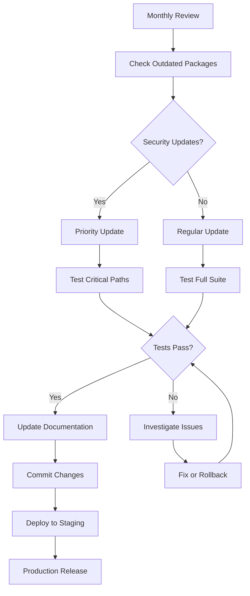

## 11-package-management.md


# 11. Package Management

> **Complete Flutter Package Management Guide** - Essential packages, version management, custom package development, and dependency optimization for production-ready Flutter applications.

## 📋 Table of Contents

- [Package Management Philosophy](#-package-management-philosophy)
- [Essential Packages](#-essential-packages)
- [Version Management Strategy](#-version-management-strategy)
- [Dependency Configuration](#-dependency-configuration)
- [Custom Package Development](#-custom-package-development)
- [Package Security & Auditing](#-package-security--auditing)
- [Performance Optimization](#-performance-optimization)
- [Private Package Repository](#-private-package-repository)
- [Package Documentation](#-package-documentation)
- [Dependency Analysis](#-dependency-analysis)
- [Best Practices](#-best-practices)

## 🎯 Package Management Philosophy

### Core Principles
```yaml
Package Strategy:
  - Minimal Dependencies: Only add what you need
  - Version Stability: Pin versions for production
  - Security First: Regular security audits
  - Performance Impact: Monitor bundle size
  - Maintenance Load: Evaluate package health
  - License Compliance: Check license compatibility
```

### Dependency Categories
```yaml
Production Dependencies:
  - Core Framework: Flutter SDK, Dart
  - State Management: BLoC, Provider, Riverpod
  - Network: Dio, HTTP
  - Storage: SharedPreferences, Hive, SQLite
  - UI Components: Material Design 3

Development Dependencies:
  - Testing: flutter_test, mockito, bloc_test
  - Code Generation: build_runner, json_annotation
  - Code Quality: dart_code_metrics, lint rules
  - Tools: flutter_launcher_icons, flutter_native_splash
```

## 📦 Essential Packages

### Complete pubspec.yaml Configuration
```yaml
name: flutter_master_template
description: Production-ready Flutter application template
version: 1.0.0+1
publish_to: 'none'

environment:
  sdk: '>=3.2.0 <4.0.0'
  flutter: ">=3.16.0"

dependencies:
  flutter:
    sdk: flutter
  
  # ═══════════════════════════════════════════════════════════════════
  # CORE DEPENDENCIES
  # ═══════════════════════════════════════════════════════════════════
  
  # State Management
  flutter_bloc: ^8.1.3                    # BLoC pattern implementation
  bloc: ^8.1.2                           # Core BLoC library
  equatable: ^2.0.5                      # Value equality
  
  # Dependency Injection
  get_it: ^7.6.4                         # Service locator
  injectable: ^2.3.2                     # Code generation for DI
  
  # Navigation
  go_router: ^12.1.3                     # Declarative routing
  
  # Network & API
  dio: ^5.3.2                            # HTTP client
  retrofit: ^4.0.3                       # Type-safe REST client
  json_annotation: ^4.8.1               # JSON serialization annotations
  
  # Local Storage
  shared_preferences: ^2.2.2             # Simple key-value storage
  flutter_secure_storage: ^9.0.0        # Secure storage
  hive: ^2.2.3                          # NoSQL database
  hive_flutter: ^1.1.0                  # Hive Flutter integration
  path_provider: ^2.1.1                 # File system paths
  
  # ═══════════════════════════════════════════════════════════════════
  # UI & DESIGN
  # ═══════════════════════════════════════════════════════════════════
  
  # Material Design & Theming
  material_color_utilities: ^0.5.0       # Material 3 color system
  dynamic_color: ^1.6.8                 # Dynamic theming
  
  # Icons & Images
  flutter_svg: ^2.0.9                   # SVG support
  cached_network_image: ^3.3.0          # Image caching
  image_picker: ^1.0.4                  # Image selection
  
  # Animations
  lottie: ^2.7.0                        # Lottie animations
  flutter_animate: ^4.3.0               # Animation utilities
  
  # UI Components
  shimmer: ^3.0.0                       # Loading shimmer effect
  flutter_staggered_grid_view: ^0.7.0   # Staggered grid layouts
  pull_to_refresh: ^2.0.0               # Pull to refresh
  
  # ═══════════════════════════════════════════════════════════════════
  # UTILITIES & SERVICES
  # ═══════════════════════════════════════════════════════════════════
  
  # Date & Time
  intl: ^0.19.0                         # Internationalization
  timeago: ^3.5.0                       # Relative time formatting
  
  # Validation & Formatting
  email_validator: ^2.1.17              # Email validation
  mask_text_input_formatter: ^2.5.0     # Input formatting
  
  # Device & Platform
  device_info_plus: ^9.1.0              # Device information
  package_info_plus: ^4.2.0             # App package info
  connectivity_plus: ^5.0.1             # Network connectivity
  
  # Permissions
  permission_handler: ^11.0.1           # Runtime permissions
  
  # ═══════════════════════════════════════════════════════════════════
  # AUTHENTICATION & SECURITY
  # ═══════════════════════════════════════════════════════════════════
  
  # Authentication
  local_auth: ^2.1.6                    # Biometric authentication
  google_sign_in: ^6.1.5                # Google Sign-In
  sign_in_with_apple: ^5.0.0            # Apple Sign-In
  
  # Security
  crypto: ^3.0.3                        # Cryptographic functions
  cryptography: ^2.5.0                  # Advanced cryptography
  
  # ═══════════════════════════════════════════════════════════════════
  # ANALYTICS & MONITORING
  # ═══════════════════════════════════════════════════════════════════
  
  # Firebase
  firebase_core: ^2.17.0                # Firebase core
  firebase_analytics: ^10.5.1           # Analytics
  firebase_crashlytics: ^3.4.8          # Crash reporting
  firebase_performance: ^0.9.3+3        # Performance monitoring
  firebase_messaging: ^14.7.0           # Push notifications
  
  # Other Analytics
  sentry_flutter: ^7.12.0               # Error tracking
  
  # ═══════════════════════════════════════════════════════════════════
  # FEATURE-SPECIFIC PACKAGES
  # ═══════════════════════════════════════════════════════════════════
  
  # Maps & Location
  google_maps_flutter: ^2.5.0           # Google Maps
  geolocator: ^10.1.0                   # Location services
  geocoding: ^2.1.1                     # Address geocoding
  
  # Camera & Media
  camera: ^0.10.5+5                     # Camera access
  video_player: ^2.7.2                  # Video playback
  audio_service: ^0.18.12               # Background audio
  
  # QR & Barcode
  qr_flutter: ^4.1.0                    # QR code generation
  mobile_scanner: ^3.5.2                # QR/Barcode scanning
  
  # File Handling
  file_picker: ^6.1.1                   # File selection
  open_filex: ^4.3.4                    # File opening
  
  # WebView
  webview_flutter: ^4.4.2               # WebView widget
  
  # ═══════════════════════════════════════════════════════════════════
  # DEVELOPMENT DEPENDENCIES
  # ═══════════════════════════════════════════════════════════════════

dev_dependencies:
  flutter_test:
    sdk: flutter
  
  # Testing Framework
  bloc_test: ^9.1.5                     # BLoC testing utilities
  mockito: ^5.4.2                       # Mocking framework
  mocktail: ^1.0.1                      # Alternative mocking
  
  # Code Generation
  build_runner: ^2.4.7                  # Code generation runner
  json_serializable: ^6.7.1             # JSON serialization
  injectable_generator: ^2.4.1          # DI code generation
  retrofit_generator: ^8.0.4            # REST client generation
  hive_generator: ^2.0.1                # Hive type adapters
  
  # Code Quality
  flutter_lints: ^3.0.1                 # Lint rules
  dart_code_metrics: ^5.7.6             # Code metrics
  custom_lint: ^0.5.7                   # Custom lint rules
  
  # Testing Utilities
  integration_test:
    sdk: flutter                         # Integration testing
  patrol: ^2.6.0                        # Advanced integration testing
  golden_toolkit: ^0.15.0               # Golden file testing
  
  # Tools
  flutter_launcher_icons: ^0.13.1       # App icon generation
  flutter_native_splash: ^2.3.6         # Splash screen generation
  rename: ^3.0.1                        # App rename utility
  
  # Import Organization
  import_sorter: ^4.6.0                 # Import sorting
  
  # Performance Analysis
  flutter_driver:
    sdk: flutter                         # Performance testing

# ═══════════════════════════════════════════════════════════════════
# DEPENDENCY OVERRIDES (Use sparingly)
# ═══════════════════════════════════════════════════════════════════

dependency_overrides:
  # Use only when necessary to resolve version conflicts
  # Example:
  # meta: ^1.9.1

# ═══════════════════════════════════════════════════════════════════
# FLUTTER CONFIGURATION
# ═══════════════════════════════════════════════════════════════════

flutter:
  uses-material-design: true
  generate: true  # Enable l10n generation
  
  assets:
    - assets/images/
    - assets/icons/
    - assets/animations/
    - assets/fonts/
  
  fonts:
    - family: Inter
      fonts:
        - asset: assets/fonts/Inter-Regular.ttf
        - asset: assets/fonts/Inter-Medium.ttf
          weight: 500
        - asset: assets/fonts/Inter-SemiBold.ttf
          weight: 600
        - asset: assets/fonts/Inter-Bold.ttf
          weight: 700

# ═══════════════════════════════════════════════════════════════════
# FLUTTER LAUNCHER ICONS
# ═══════════════════════════════════════════════════════════════════

flutter_launcher_icons:
  android: "launcher_icon"
  ios: true
  image_path: "assets/icons/app_icon.png"
  min_sdk_android: 21
  web:
    generate: true
    image_path: "assets/icons/app_icon.png"
    background_color: "#hexcode"
    theme_color: "#hexcode"
  windows:
    generate: true
    image_path: "assets/icons/app_icon.png"
    icon_size: 48
  macos:
    generate: true
    image_path: "assets/icons/app_icon.png"

# ═══════════════════════════════════════════════════════════════════
# FLUTTER NATIVE SPLASH
# ═══════════════════════════════════════════════════════════════════

flutter_native_splash:
  color: "#ffffff"
  image: assets/images/splash_logo.png
  color_dark: "#121212"
  image_dark: assets/images/splash_logo_dark.png
  android_12:
    image: assets/images/splash_logo_android12.png
    icon_background_color: "#ffffff"
    image_dark: assets/images/splash_logo_android12_dark.png
    icon_background_color_dark: "#121212"
  web: false
```

## 🔄 Version Management Strategy

### Semantic Versioning Approach
```yaml
# Version Strategy
Major.Minor.Patch+Build

Examples:
  1.0.0+1     # Initial release
  1.0.1+2     # Bug fix
  1.1.0+3     # New features (backward compatible)
  2.0.0+4     # Breaking changes

Version Constraints:
  Exact: package_name: 1.0.0
  Range: package_name: '>=1.0.0 <2.0.0'
  Caret: package_name: ^1.0.0  # >=1.0.0 <2.0.0
  Compatible: package_name: ~1.0.0  # >=1.0.0 <1.1.0
```

### Version Lock Configuration
```yaml
# pubspec_overrides.yaml (for version locking)
dependency_overrides:
  # Lock critical packages to specific versions
  flutter_bloc: 8.1.3
  dio: 5.3.2
  go_router: 12.1.3
  
  # Allow minor updates for utilities
  intl: ^0.19.0
  equatable: ^2.0.5
```

### Version Update Script
```bash
#!/bin/bash
# scripts/update-dependencies.sh

set -e

echo "📦 Flutter Dependency Update Script"
echo "=================================="

# Backup current pubspec.lock
cp pubspec.lock pubspec.lock.backup
echo "✅ Backed up pubspec.lock"

# Check for outdated packages
echo "🔍 Checking for outdated packages..."
flutter pub outdated --mode=null-safety

# Update dependencies
echo "📦 Updating dependencies..."
flutter pub upgrade

# Run tests to ensure compatibility
echo "🧪 Running tests after update..."
flutter test

# Check for breaking changes
echo "🔍 Analyzing for breaking changes..."
dart pub deps --json > deps_after.json

# Compare with previous state
if [ -f "deps_before.json" ]; then
    echo "📊 Dependency changes:"
    python3 scripts/compare_deps.py deps_before.json deps_after.json
fi

# Save current state for next comparison
mv deps_after.json deps_before.json

# Check for security vulnerabilities
echo "🔒 Checking for security vulnerabilities..."
dart pub audit

echo "✅ Dependency update completed successfully!"
echo ""
echo "📋 Next Steps:"
echo "1. Review dependency changes"
echo "2. Test application thoroughly"
echo "3. Update documentation if needed"
echo "4. Commit changes to version control"
```

### Dependency Comparison Tool
```python
# scripts/compare_deps.py
import json
import sys
from typing import Dict, Set

def load_deps(file_path: str) -> Dict[str, str]:
    """Load dependencies from JSON file."""
    with open(file_path, 'r') as f:
        data = json.load(f)
    
    deps = {}
    packages = data.get('packages', {})
    
    for name, info in packages.items():
        if isinstance(info, dict) and 'version' in info:
            deps[name] = info['version']
    
    return deps

def compare_dependencies(before_file: str, after_file: str):
    """Compare two dependency files and show changes."""
    deps_before = load_deps(before_file)
    deps_after = load_deps(after_file)
    
    before_packages = set(deps_before.keys())
    after_packages = set(deps_after.keys())
    
    # New packages
    new_packages = after_packages - before_packages
    if new_packages:
        print("📦 New packages:")
        for pkg in sorted(new_packages):
            print(f"  + {pkg}: {deps_after[pkg]}")
        print()
    
    # Removed packages
    removed_packages = before_packages - after_packages
    if removed_packages:
        print("🗑️ Removed packages:")
        for pkg in sorted(removed_packages):
            print(f"  - {pkg}: {deps_before[pkg]}")
        print()
    
    # Updated packages
    common_packages = before_packages & after_packages
    updated_packages = []
    
    for pkg in common_packages:
        if deps_before[pkg] != deps_after[pkg]:
            updated_packages.append(pkg)
    
    if updated_packages:
        print("🔄 Updated packages:")
        for pkg in sorted(updated_packages):
            print(f"  {pkg}: {deps_before[pkg]} → {deps_after[pkg]}")
        print()
    
    # Summary
    total_changes = len(new_packages) + len(removed_packages) + len(updated_packages)
    print(f"📊 Summary: {total_changes} changes total")
    print(f"   • {len(new_packages)} new")
    print(f"   • {len(removed_packages)} removed") 
    print(f"   • {len(updated_packages)} updated")

if __name__ == "__main__":
    if len(sys.argv) != 3:
        print("Usage: python compare_deps.py <before.json> <after.json>")
        sys.exit(1)
    
    compare_dependencies(sys.argv[1], sys.argv[2])
```

## 🏗️ Custom Package Development

### Package Structure Template
```
my_custom_package/
├── lib/
│   ├── src/
│   │   ├── models/
│   │   ├── services/
│   │   ├── widgets/
│   │   └── utils/
│   └── my_custom_package.dart
├── test/
│   ├── src/
│   └── my_custom_package_test.dart
├── example/
│   ├── lib/
│   │   └── main.dart
│   └── pubspec.yaml
├── doc/
│   └── api/
├── CHANGELOG.md
├── LICENSE
├── README.md
└── pubspec.yaml
```

### Custom Package pubspec.yaml
```yaml
name: flutter_master_widgets
description: Custom widget library for Flutter Master Template
version: 1.0.0
homepage: https://github.com/your-org/flutter-master-widgets
repository: https://github.com/your-org/flutter-master-widgets
issue_tracker: https://github.com/your-org/flutter-master-widgets/issues

environment:
  sdk: '>=3.2.0 <4.0.0'
  flutter: ">=3.16.0"

dependencies:
  flutter:
    sdk: flutter
  
  # Keep dependencies minimal for packages
  material_color_utilities: ^0.5.0
  flutter_animate: ^4.3.0

dev_dependencies:
  flutter_test:
    sdk: flutter
  flutter_lints: ^3.0.1

flutter:
  # No assets in base package
```

### Custom Widget Example
```dart
// lib/src/widgets/custom_card.dart
import 'package:flutter/material.dart';
import 'package:flutter_animate/flutter_animate.dart';

/// A customizable card widget with Material 3 design and animations.
///
/// The [CustomCard] provides a consistent card design across the application
/// with built-in animations, elevation, and theming support.
///
/// Example usage:
/// ```dart
/// CustomCard(
///   title: 'Card Title',
///   subtitle: 'Card subtitle',
///   child: Text('Card content'),
///   onTap: () => print('Card tapped'),
/// )
/// ```
class CustomCard extends StatelessWidget {
  /// Creates a [CustomCard].
  ///
  /// The [child] parameter is required.
  const CustomCard({
    super.key,
    required this.child,
    this.title,
    this.subtitle,
    this.leading,
    this.trailing,
    this.onTap,
    this.onLongPress,
    this.margin = const EdgeInsets.all(8.0),
    this.padding = const EdgeInsets.all(16.0),
    this.elevation = 2.0,
    this.borderRadius = const BorderRadius.all(Radius.circular(12.0)),
    this.backgroundColor,
    this.shadowColor,
    this.animationDuration = const Duration(milliseconds: 200),
    this.enableAnimation = true,
  });

  /// The primary content of the card.
  final Widget child;

  /// Optional title displayed at the top of the card.
  final String? title;

  /// Optional subtitle displayed below the title.
  final String? subtitle;

  /// Optional widget displayed before the title.
  final Widget? leading;

  /// Optional widget displayed after the title.
  final Widget? trailing;

  /// Callback invoked when the card is tapped.
  final VoidCallback? onTap;

  /// Callback invoked when the card is long-pressed.
  final VoidCallback? onLongPress;

  /// The margin around the card.
  final EdgeInsetsGeometry margin;

  /// The padding inside the card.
  final EdgeInsetsGeometry padding;

  /// The elevation of the card.
  final double elevation;

  /// The border radius of the card.
  final BorderRadiusGeometry borderRadius;

  /// The background color of the card.
  final Color? backgroundColor;

  /// The shadow color of the card.
  final Color? shadowColor;

  /// The duration of entrance animations.
  final Duration animationDuration;

  /// Whether to enable entrance animations.
  final bool enableAnimation;

  @override
  Widget build(BuildContext context) {
    final theme = Theme.of(context);
    final cardTheme = theme.cardTheme;

    Widget cardContent = Card(
      margin: EdgeInsets.zero,
      elevation: elevation,
      color: backgroundColor ?? cardTheme.color,
      shadowColor: shadowColor ?? cardTheme.shadowColor,
      shape: RoundedRectangleBorder(borderRadius: borderRadius),
      child: InkWell(
        onTap: onTap,
        onLongPress: onLongPress,
        borderRadius: borderRadius,
        child: Padding(
          padding: padding,
          child: Column(
            crossAxisAlignment: CrossAxisAlignment.start,
            mainAxisSize: MainAxisSize.min,
            children: [
              if (title != null || subtitle != null || leading != null || trailing != null)
                _buildHeader(context),
              if (title != null || subtitle != null)
                const SizedBox(height: 12.0),
              child,
            ],
          ),
        ),
      ),
    );

    // Add animation if enabled
    if (enableAnimation) {
      cardContent = cardContent
          .animate()
          .fadeIn(duration: animationDuration)
          .slideY(
            begin: 0.1,
            end: 0.0,
            duration: animationDuration,
            curve: Curves.easeOutCubic,
          );
    }

    return Container(
      margin: margin,
      child: cardContent,
    );
  }

  Widget _buildHeader(BuildContext context) {
    final theme = Theme.of(context);
    
    return Row(
      children: [
        if (leading != null) ...[
          leading!,
          const SizedBox(width: 12.0),
        ],
        Expanded(
          child: Column(
            crossAxisAlignment: CrossAxisAlignment.start,
            children: [
              if (title != null)
                Text(
                  title!,
                  style: theme.textTheme.titleMedium?.copyWith(
                    fontWeight: FontWeight.w600,
                  ),
                ),
              if (subtitle != null) ...[
                const SizedBox(height: 4.0),
                Text(
                  subtitle!,
                  style: theme.textTheme.bodyMedium?.copyWith(
                    color: theme.colorScheme.onSurfaceVariant,
                  ),
                ),
              ],
            ],
          ),
        ),
        if (trailing != null) ...[
          const SizedBox(width: 12.0),
          trailing!,
        ],
      ],
    );
  }
}
```

### Package Export File
```dart
// lib/flutter_master_widgets.dart

/// Flutter Master Widgets Library
///
/// A collection of custom widgets designed for the Flutter Master Template.
/// Provides consistent Material 3 design with animations and theming support.
library flutter_master_widgets;

// Widgets
export 'src/widgets/custom_card.dart';
export 'src/widgets/custom_button.dart';
export 'src/widgets/custom_text_field.dart';
export 'src/widgets/loading_overlay.dart';
export 'src/widgets/empty_state.dart';
export 'src/widgets/error_state.dart';

// Models
export 'src/models/widget_theme_data.dart';

// Utils
export 'src/utils/widget_extensions.dart';
export 'src/utils/animation_utils.dart';

// Constants
export 'src/constants/widget_constants.dart';
```

### Package Testing
```dart
// test/src/widgets/custom_card_test.dart
import 'package:flutter/material.dart';
import 'package:flutter_test/flutter_test.dart';
import 'package:flutter_master_widgets/flutter_master_widgets.dart';

void main() {
  group('CustomCard Widget Tests', () {
    testWidgets('displays child content', (tester) async {
      const testChild = Text('Test Content');
      
      await tester.pumpWidget(
        const MaterialApp(
          home: Scaffold(
            body: CustomCard(
              child: testChild,
            ),
          ),
        ),
      );
      
      expect(find.text('Test Content'), findsOneWidget);
      expect(find.byType(Card), findsOneWidget);
    });
    
    testWidgets('displays title and subtitle when provided', (tester) async {
      await tester.pumpWidget(
        const MaterialApp(
          home: Scaffold(
            body: CustomCard(
              title: 'Test Title',
              subtitle: 'Test Subtitle',
              child: Text('Content'),
            ),
          ),
        ),
      );
      
      expect(find.text('Test Title'), findsOneWidget);
      expect(find.text('Test Subtitle'), findsOneWidget);
    });
    
    testWidgets('handles tap events', (tester) async {
      var tapped = false;
      
      await tester.pumpWidget(
        MaterialApp(
          home: Scaffold(
            body: CustomCard(
              onTap: () => tapped = true,
              child: const Text('Tap me'),
            ),
          ),
        ),
      );
      
      await tester.tap(find.byType(CustomCard));
      expect(tapped, isTrue);
    });
    
    testWidgets('applies custom styling', (tester) async {
      const customColor = Colors.red;
      const customElevation = 8.0;
      
      await tester.pumpWidget(
        const MaterialApp(
          home: Scaffold(
            body: CustomCard(
              backgroundColor: customColor,
              elevation: customElevation,
              child: Text('Styled'),
            ),
          ),
        ),
      );
      
      final card = tester.widget<Card>(find.byType(Card));
      expect(card.color, customColor);
      expect(card.elevation, customElevation);
    });
    
    group('Animation Tests', () {
      testWidgets('animates entrance when enabled', (tester) async {
        await tester.pumpWidget(
          const MaterialApp(
            home: Scaffold(
              body: CustomCard(
                enableAnimation: true,
                animationDuration: Duration(milliseconds: 100),
                child: Text('Animated'),
              ),
            ),
          ),
        );
        
        // Initial state should have some animation properties
        await tester.pump();
        await tester.pump(const Duration(milliseconds: 50));
        await tester.pumpAndSettle();
        
        expect(find.text('Animated'), findsOneWidget);
      });
      
      testWidgets('skips animation when disabled', (tester) async {
        await tester.pumpWidget(
          const MaterialApp(
            home: Scaffold(
              body: CustomCard(
                enableAnimation: false,
                child: Text('Not Animated'),
              ),
            ),
          ),
        );
        
        expect(find.text('Not Animated'), findsOneWidget);
      });
    });
  });
}
```

## 🔒 Package Security & Auditing

### Security Audit Script
```bash
#!/bin/bash
# scripts/security-audit.sh

set -e

echo "🔒 Package Security Audit"
echo "========================"

# Run Flutter pub audit
echo "🔍 Running Flutter pub audit..."
flutter pub audit

# Check for known vulnerabilities
echo "🔍 Checking for known vulnerabilities..."
if command -v npm &> /dev/null; then
    # Use npm audit for additional security checks
    npm audit --audit-level=moderate || true
fi

# Check package licenses
echo "📜 Checking package licenses..."
dart run scripts/check_licenses.dart

# Check for suspicious packages
echo "🕵️ Checking for suspicious packages..."
dart run scripts/check_suspicious_packages.dart

# Generate security report
echo "📊 Generating security report..."
cat > security-audit-report.md << EOF
# Package Security Audit Report

**Date:** $(date)
**Flutter Version:** $(flutter --version | head -1)
**Dart Version:** $(dart --version)

## Audit Results

### Flutter Pub Audit
$(flutter pub audit 2>&1 || echo "No vulnerabilities found")

### License Compliance
$(dart run scripts/check_licenses.dart 2>&1 || echo "All licenses compliant")

### Suspicious Package Check
$(dart run scripts/check_suspicious_packages.dart 2>&1 || echo "No suspicious packages found")

## Recommendations

1. Keep packages updated regularly
2. Monitor security advisories
3. Review new dependencies carefully
4. Use specific version constraints for critical packages

---
*Generated by security audit script*
EOF

echo "✅ Security audit completed. Report saved to security-audit-report.md"
```

### License Checker
```dart
// scripts/check_licenses.dart
import 'dart:io';
import 'dart:convert';

void main() async {
  print('📜 Checking package licenses...');
  
  // Get dependency information
  final result = await Process.run('dart', ['pub', 'deps', '--json']);
  final depsData = jsonDecode(result.stdout);
  
  final packages = depsData['packages'] as Map<String, dynamic>;
  final licenseIssues = <String>[];
  final allowedLicenses = {
    'MIT',
    'Apache-2.0',
    'BSD-3-Clause',
    'BSD-2-Clause',
    'ISC',
    'Apache License 2.0',
    'MIT License',
    'BSD License',
  };
  
  for (final package in packages.entries) {
    final packageInfo = package.value as Map<String, dynamic>;
    final packageName = package.key;
    
    // Skip local packages
    if (packageInfo['kind'] == 'root') continue;
    
    // Check license (this is simplified - in practice you'd fetch from pub.dev API)
    final license = await _getPackageLicense(packageName);
    
    if (license != null && !allowedLicenses.contains(license)) {
      licenseIssues.add('$packageName: $license');
    }
  }
  
  if (licenseIssues.isNotEmpty) {
    print('❌ License issues found:');
    for (final issue in licenseIssues) {
      print('  • $issue');
    }
    exit(1);
  } else {
    print('✅ All package licenses are compliant');
  }
}

```dart
Future<String?> _getPackageLicense(String packageName) async {
  try {
    // In a real implementation, you would call the pub.dev API
    // GET https://pub.dev/api/packages/{packageName}
    // For now, we'll simulate with common licenses
    
    final commonLicenses = {
      'flutter': 'BSD-3-Clause',
      'dio': 'MIT',
      'bloc': 'MIT',
      'equatable': 'MIT',
      'get_it': 'MIT',
      'go_router': 'BSD-3-Clause',
      'shared_preferences': 'BSD-3-Clause',
      'http': 'BSD-3-Clause',
    };
    
    return commonLicenses[packageName] ?? 'MIT'; // Default to MIT
  } catch (e) {
    print('⚠️ Could not determine license for $packageName');
    return null;
  }
}
```

### Suspicious Package Detector
```dart
// scripts/check_suspicious_packages.dart
import 'dart:io';
import 'dart:convert';

void main() async {
  print('🕵️ Checking for suspicious packages...');
  
  final result = await Process.run('dart', ['pub', 'deps', '--json']);
  final depsData = jsonDecode(result.stdout);
  
  final packages = depsData['packages'] as Map<String, dynamic>;
  final suspiciousPackages = <String>[];
  
  // Define suspicious patterns
  final suspiciousPatterns = [
    'test', 'debug', 'temp', 'hack', 'exploit', 
    'backdoor', 'malware', 'virus', 'trojan'
  ];
  
  // Check for typosquatting
  final popularPackages = [
    'flutter', 'dio', 'http', 'bloc', 'provider',
    'shared_preferences', 'path_provider', 'sqflite'
  ];
  
  for (final package in packages.entries) {
    final packageName = package.key.toLowerCase();
    final packageInfo = package.value as Map<String, dynamic>;
    
    // Skip local and root packages
    if (packageInfo['kind'] == 'root') continue;
    
    // Check for suspicious patterns in name
    for (final pattern in suspiciousPatterns) {
      if (packageName.contains(pattern)) {
        suspiciousPackages.add('$packageName: Contains suspicious pattern "$pattern"');
      }
    }
    
    // Check for potential typosquatting
    for (final popular in popularPackages) {
      if (_isTyposquatting(packageName, popular)) {
        suspiciousPackages.add('$packageName: Potential typosquatting of "$popular"');
      }
    }
    
    // Check for very new packages (version 0.x.x)
    final version = packageInfo['version'] as String?;
    if (version != null && version.startsWith('0.0.')) {
      suspiciousPackages.add('$packageName: Very early version ($version)');
    }
  }
  
  if (suspiciousPackages.isNotEmpty) {
    print('⚠️ Suspicious packages detected:');
    for (final suspicious in suspiciousPackages) {
      print('  • $suspicious');
    }
    print('\n🔍 Please review these packages carefully before using in production.');
  } else {
    print('✅ No suspicious packages detected');
  }
}

bool _isTyposquatting(String packageName, String popularName) {
  // Simple edit distance check for typosquatting
  if (packageName == popularName) return false;
  
  final distance = _levenshteinDistance(packageName, popularName);
  return distance == 1 && packageName.length == popularName.length;
}

int _levenshteinDistance(String s1, String s2) {
  final m = s1.length;
  final n = s2.length;
  
  final dp = List.generate(m + 1, (i) => List.filled(n + 1, 0));
  
  for (int i = 0; i <= m; i++) dp[i][0] = i;
  for (int j = 0; j <= n; j++) dp[0][j] = j;
  
  for (int i = 1; i <= m; i++) {
    for (int j = 1; j <= n; j++) {
      if (s1[i - 1] == s2[j - 1]) {
        dp[i][j] = dp[i - 1][j - 1];
      } else {
        dp[i][j] = 1 + [dp[i - 1][j], dp[i][j - 1], dp[i - 1][j - 1]].reduce((a, b) => a < b ? a : b);
      }
    }
  }
  
  return dp[m][n];
}
```

## ⚡ Performance Optimization

### Bundle Size Analysis
```bash
#!/bin/bash
# scripts/analyze-bundle-size.sh

set -e

echo "📊 Bundle Size Analysis"
echo "======================"

# Build release version
echo "🏗️ Building release version..."
flutter build apk --analyze-size --target-platform android-arm64

# Extract APK and analyze
echo "📦 Analyzing APK contents..."
APK_PATH="build/app/outputs/flutter-apk/app-release.apk"

if [ -f "$APK_PATH" ]; then
    # Create analysis directory
    mkdir -p analysis/apk
    
    # Extract APK
    unzip -q "$APK_PATH" -d analysis/apk/
    
    # Analyze Flutter assets
    echo "📊 Flutter asset sizes:"
    find analysis/apk/assets/flutter_assets -type f -exec ls -lah {} \; | \
        awk '{print $5 "\t" $9}' | sort -hr
    
    # Analyze native libraries
    echo ""
    echo "📊 Native library sizes:"
    find analysis/apk/lib -name "*.so" -exec ls -lah {} \; | \
        awk '{print $5 "\t" $9}' | sort -hr
    
    # Total APK size
    APK_SIZE=$(ls -lah "$APK_PATH" | awk '{print $5}')
    echo ""
    echo "📦 Total APK size: $APK_SIZE"
    
    # Generate size report
    cat > analysis/bundle-size-report.md << EOF
# Bundle Size Analysis Report

**Date:** $(date)
**APK Size:** $APK_SIZE

## Asset Breakdown

### Flutter Assets
\`\`\`
$(find analysis/apk/assets/flutter_assets -type f -exec ls -lah {} \; | awk '{print $5 "\t" $9}' | sort -hr | head -20)
\`\`\`

### Native Libraries
\`\`\`
$(find analysis/apk/lib -name "*.so" -exec ls -lah {} \; | awk '{print $5 "\t" $9}' | sort -hr)
\`\`\`

## Recommendations

1. Optimize large assets (compress images, use WebP format)
2. Remove unused dependencies
3. Use code splitting for large features
4. Consider using vector graphics instead of raster images

---
*Generated by bundle size analysis script*
EOF
    
    echo "✅ Bundle size analysis completed. Report saved to analysis/bundle-size-report.md"
else
    echo "❌ APK not found. Build may have failed."
    exit 1
fi
```

### Dependency Tree Analysis
```dart
// scripts/analyze_dependency_tree.dart
import 'dart:io';
import 'dart:convert';

void main() async {
  print('🌳 Analyzing dependency tree...');
  
  // Get dependency tree
  final result = await Process.run('dart', ['pub', 'deps', '--json']);
  final depsData = jsonDecode(result.stdout);
  
  final packages = depsData['packages'] as Map<String, dynamic>;
  final analysis = DependencyAnalysis();
  
  // Analyze each package
  for (final package in packages.entries) {
    final packageInfo = package.value as Map<String, dynamic>;
    analysis.addPackage(package.key, packageInfo);
  }
  
  // Generate report
  analysis.generateReport();
}

class DependencyAnalysis {
  final Map<String, PackageInfo> packages = {};
  final Map<String, Set<String>> dependencyGraph = {};
  
  void addPackage(String name, Map<String, dynamic> info) {
    final packageInfo = PackageInfo.fromJson(name, info);
    packages[name] = packageInfo;
    
    // Build dependency graph
    final dependencies = info['dependencies'] as List<dynamic>? ?? [];
    dependencyGraph[name] = dependencies.cast<String>().toSet();
  }
  
  void generateReport() {
    print('\n📊 Dependency Analysis Report');
    print('============================');
    
    _analyzePackageCount();
    _analyzeDeepDependencies();
    _analyzeDuplicateDependencies();
    _analyzePackageVersions();
    _generateOptimizationSuggestions();
  }
  
  void _analyzePackageCount() {
    final directDeps = packages.values.where((p) => p.isDirect).length;
    final transitiveDeps = packages.values.where((p) => p.isTransitive).length;
    
    print('\n📦 Package Count:');
    print('  • Direct dependencies: $directDeps');
    print('  • Transitive dependencies: $transitiveDeps');
    print('  • Total packages: ${packages.length}');
  }
  
  void _analyzeDeepDependencies() {
    final deepPackages = <String>[];
    
    for (final package in packages.keys) {
      final depth = _calculateDependencyDepth(package);
      if (depth > 5) {
        deepPackages.add('$package (depth: $depth)');
      }
    }
    
    if (deepPackages.isNotEmpty) {
      print('\n🔍 Deep dependency chains:');
      for (final deep in deepPackages) {
        print('  • $deep');
      }
    }
  }
  
  void _analyzeDuplicateDependencies() {
    final versionGroups = <String, List<String>>{};
    
    for (final package in packages.values) {
      final baseName = package.name.split('_').first;
      versionGroups.putIfAbsent(baseName, () => []).add(package.name);
    }
    
    final duplicates = versionGroups.entries
        .where((entry) => entry.value.length > 1)
        .toList();
    
    if (duplicates.isNotEmpty) {
      print('\n⚠️ Potential duplicate functionality:');
      for (final duplicate in duplicates) {
        print('  • ${duplicate.key}: ${duplicate.value.join(', ')}');
      }
    }
  }
  
  void _analyzePackageVersions() {
    final outdatedPackages = <String>[];
    
    for (final package in packages.values) {
      if (package.version.startsWith('0.')) {
        outdatedPackages.add('${package.name}@${package.version}');
      }
    }
    
    if (outdatedPackages.isNotEmpty) {
      print('\n📅 Pre-release versions:');
      for (final outdated in outdatedPackages) {
        print('  • $outdated');
      }
    }
  }
  
  void _generateOptimizationSuggestions() {
    print('\n💡 Optimization Suggestions:');
    
    // Large dependency count
    if (packages.length > 100) {
      print('  • Consider reducing dependencies (current: ${packages.length})');
    }
    
    // Deep dependency chains
    final deepCount = packages.keys
        .where((pkg) => _calculateDependencyDepth(pkg) > 5)
        .length;
    if (deepCount > 0) {
      print('  • Review deep dependency chains ($deepCount packages)');
    }
    
    // Version constraints
    final directPackages = packages.values.where((p) => p.isDirect);
    final withoutConstraints = directPackages
        .where((p) => !p.version.contains('^') && !p.version.contains('>='))
        .length;
    if (withoutConstraints > 0) {
      print('  • Add version constraints to $withoutConstraints packages');
    }
    
    print('  • Regularly audit and update dependencies');
    print('  • Use `dart pub deps --style=compact` for overview');
  }
  
  int _calculateDependencyDepth(String packageName, [Set<String>? visited]) {
    visited ??= <String>{};
    
    if (visited.contains(packageName)) {
      return 0; // Circular dependency
    }
    
    visited.add(packageName);
    
    final dependencies = dependencyGraph[packageName] ?? <String>{};
    if (dependencies.isEmpty) {
      return 1;
    }
    
    int maxDepth = 0;
    for (final dep in dependencies) {
      final depth = _calculateDependencyDepth(dep, Set.from(visited));
      if (depth > maxDepth) {
        maxDepth = depth;
      }
    }
    
    return maxDepth + 1;
  }
}

class PackageInfo {
  final String name;
  final String version;
  final String kind;
  
  PackageInfo({
    required this.name,
    required this.version,
    required this.kind,
  });
  
  factory PackageInfo.fromJson(String name, Map<String, dynamic> json) {
    return PackageInfo(
      name: name,
      version: json['version'] as String? ?? 'unknown',
      kind: json['kind'] as String? ?? 'direct',
    );
  }
  
  bool get isDirect => kind == 'direct';
  bool get isTransitive => kind == 'transitive';
  bool get isDev => kind == 'dev';
}
```

## 🏢 Private Package Repository

### Private Repository Setup
```yaml
# .pub-cache/credentials.json (for private repositories)
{
  "accessToken": "your-private-repo-token",
  "refreshToken": "your-refresh-token",
  "tokenEndpoint": "https://your-private-repo.com/api/oauth/token",
  "scopes": ["read", "write"],
  "expiration": 1234567890
}
```

### Private Package Publishing
```bash
#!/bin/bash
# scripts/publish-private-package.sh

set -e

PACKAGE_NAME=${1:-$(grep '^name:' pubspec.yaml | cut -d' ' -f2)}
VERSION=${2:-$(grep '^version:' pubspec.yaml | cut -d' ' -f2)}
REPO_URL=${3:-"https://your-private-repo.com"}

echo "📦 Publishing Private Package"
echo "============================="
echo "Package: $PACKAGE_NAME"
echo "Version: $VERSION"
echo "Repository: $REPO_URL"

# Validate package
echo "✅ Validating package..."
dart pub publish --dry-run

# Run tests
echo "🧪 Running tests..."
dart test

# Check formatting
echo "📏 Checking formatting..."
dart format --set-exit-if-changed .

# Analyze code
echo "🔍 Analyzing code..."
dart analyze --fatal-infos

# Generate documentation
echo "📚 Generating documentation..."
dart doc .

# Build package
echo "🏗️ Building package..."
dart pub get

# Publish to private repository
echo "🚀 Publishing to private repository..."
dart pub publish --server="$REPO_URL/packages"

echo "✅ Package published successfully!"
echo "📦 $PACKAGE_NAME@$VERSION is now available at $REPO_URL"
```

### Private Package Usage
```yaml
# pubspec.yaml for using private packages
dependencies:
  flutter:
    sdk: flutter
  
  # Private package from hosted repository
  my_private_package:
    hosted:
      name: my_private_package
      url: https://your-private-repo.com
    version: ^1.0.0
  
  # Private package from Git repository
  my_git_package:
    git:
      url: https://github.com/your-org/my-git-package.git
      ref: main
      path: packages/my_package
  
  # Local development package
  my_local_package:
    path: ../packages/my_local_package

# Override resolver for private packages
dependency_overrides:
  my_private_package:
    hosted:
      name: my_private_package
      url: https://your-private-repo.com
    version: 1.2.3  # Pin to specific version
```

## 📚 Package Documentation

### Documentation Generation Script
```bash
#!/bin/bash
# scripts/generate-docs.sh

set -e

echo "📚 Generating Package Documentation"
echo "=================================="

# Generate API documentation
echo "📖 Generating API docs..."
dart doc --output docs/api

# Generate README if it doesn't exist
if [ ! -f "README.md" ]; then
    echo "📝 Generating README.md..."
    cat > README.md << EOF
# $(grep '^name:' pubspec.yaml | cut -d' ' -f2)

$(grep '^description:' pubspec.yaml | cut -d' ' -f2-)

## Installation

Add this package to your \`pubspec.yaml\`:

\`\`\`yaml
dependencies:
  $(grep '^name:' pubspec.yaml | cut -d' ' -f2): ^$(grep '^version:' pubspec.yaml | cut -d' ' -f2 | cut -d'+' -f1)
\`\`\`

## Usage

\`\`\`dart
import 'package:$(grep '^name:' pubspec.yaml | cut -d' ' -f2)/$(grep '^name:' pubspec.yaml | cut -d' ' -f2).dart';

// TODO: Add usage examples
\`\`\`

## Features

- TODO: List key features

## API Reference

For detailed API documentation, see the [API reference](docs/api/index.html).

## Contributing

Please read [CONTRIBUTING.md](CONTRIBUTING.md) for details on our code of conduct and the process for submitting pull requests.

## License

This project is licensed under the MIT License - see the [LICENSE](LICENSE) file for details.
EOF
fi

# Generate CHANGELOG if it doesn't exist
if [ ! -f "CHANGELOG.md" ]; then
    echo "📝 Generating CHANGELOG.md..."
    cat > CHANGELOG.md << EOF
# Changelog

All notable changes to this project will be documented in this file.

The format is based on [Keep a Changelog](https://keepachangelog.com/en/1.0.0/),
and this project adheres to [Semantic Versioning](https://semver.org/spec/v2.0.0.html).

## [$(grep '^version:' pubspec.yaml | cut -d' ' -f2 | cut -d'+' -f1)] - $(date +%Y-%m-%d)

### Added
- Initial release

### Changed
- N/A

### Deprecated
- N/A

### Removed
- N/A

### Fixed
- N/A

### Security
- N/A
EOF
fi

# Validate documentation
echo "✅ Validating documentation..."
if [ -d "example" ]; then
    cd example
    dart analyze
    cd ..
fi

echo "✅ Documentation generation completed!"
echo "📂 API docs: docs/api/index.html"
echo "📄 README: README.md"
echo "📋 CHANGELOG: CHANGELOG.md"
```

## 📊 Dependency Analysis

### Automated Dependency Health Check
```dart
// scripts/dependency_health_check.dart
import 'dart:io';
import 'dart:convert';
import 'package:http/http.dart' as http;

void main() async {
  print('🏥 Dependency Health Check');
  print('=========================');
  
  final healthChecker = DependencyHealthChecker();
  await healthChecker.checkHealth();
}

class DependencyHealthChecker {
  Future<void> checkHealth() async {
    // Get dependency information
    final result = await Process.run('dart', ['pub', 'deps', '--json']);
    final depsData = jsonDecode(result.stdout);
    
    final packages = depsData['packages'] as Map<String, dynamic>;
    final healthReport = HealthReport();
    
    print('🔍 Checking ${packages.length} packages...\n');
    
    for (final package in packages.entries) {
      final packageInfo = package.value as Map<String, dynamic>;
      if (packageInfo['kind'] == 'root') continue;
      
      final health = await _checkPackageHealth(package.key, packageInfo);
      healthReport.addPackage(package.key, health);
      
      _printPackageStatus(package.key, health);
    }
    
    healthReport.printSummary();
  }
  
  Future<PackageHealth> _checkPackageHealth(
    String name, 
    Map<String, dynamic> info,
  ) async {
    final health = PackageHealth(name: name);
    
    try {
      // Get package info from pub.dev
      final response = await http.get(
        Uri.parse('https://pub.dev/api/packages/$name'),
        headers: {'Accept': 'application/json'},
      ).timeout(Duration(seconds: 10));
      
      if (response.statusCode == 200) {
        final pubData = jsonDecode(response.body);
        health.isAvailable = true;
        health.latestVersion = pubData['latest']['version'];
        health.currentVersion = info['version'] ?? 'unknown';
        health.isUpToDate = health.currentVersion == health.latestVersion;
        
        // Check metrics
        final score = await _getPackageScore(name);
        health.popularity = score['popularity'] ?? 0.0;
        health.maintenance = score['maintenance'] ?? 0.0;
        health.likes = score['likes'] ?? 0;
        
        // Check last published date
        final published = DateTime.tryParse(pubData['latest']['published']);
        if (published != null) {
          final daysSince = DateTime.now().difference(published).inDays;
          health.daysSinceLastUpdate = daysSince;
          health.isRecent = daysSince < 365; // Updated within a year
        }
        
      } else {
        health.isAvailable = false;
      }
    } catch (e) {
      health.isAvailable = false;
      health.error = e.toString();
    }
    
    return health;
  }
  
  Future<Map<String, dynamic>> _getPackageScore(String name) async {
    try {
      final response = await http.get(
        Uri.parse('https://pub.dev/api/packages/$name/score'),
        headers: {'Accept': 'application/json'},
      ).timeout(Duration(seconds: 5));
      
      if (response.statusCode == 200) {
        return jsonDecode(response.body);
      }
    } catch (e) {
      // Ignore scoring errors
    }
    
    return {};
  }
  
  void _printPackageStatus(String name, PackageHealth health) {
    final status = _getHealthStatus(health);
    final indicator = _getStatusIndicator(status);
    
    print('$indicator $name (${health.currentVersion})');
    
    if (status == HealthStatus.outdated) {
      print('   📅 Update available: ${health.latestVersion}');
    }
    
    if (status == HealthStatus.unhealthy) {
      print('   ⚠️ ${health.error ?? "Package may be abandoned"}');
    }
    
    if (health.daysSinceLastUpdate != null && health.daysSinceLastUpdate! > 730) {
      print('   🕰️ Last updated ${health.daysSinceLastUpdate} days ago');
    }
  }
  
  HealthStatus _getHealthStatus(PackageHealth health) {
    if (!health.isAvailable) return HealthStatus.unavailable;
    if (!health.isUpToDate) return HealthStatus.outdated;
    if (!health.isRecent) return HealthStatus.unhealthy;
    if (health.maintenance < 0.5) return HealthStatus.unhealthy;
    
    return HealthStatus.healthy;
  }
  
  String _getStatusIndicator(HealthStatus status) {
    switch (status) {
      case HealthStatus.healthy:
        return '✅';
      case HealthStatus.outdated:
        return '📅';
      case HealthStatus.unhealthy:
        return '⚠️';
      case HealthStatus.unavailable:
        return '❌';
    }
  }
}

class PackageHealth {
  final String name;
  bool isAvailable = false;
  bool isUpToDate = false;
  bool isRecent = false;
  String currentVersion = '';
  String latestVersion = '';
  double popularity = 0.0;
  double maintenance = 0.0;
  int likes = 0;
  int? daysSinceLastUpdate;
  String? error;
  
  PackageHealth({required this.name});
}

enum HealthStatus {
  healthy,
  outdated,
  unhealthy,
  unavailable,
}

class HealthReport {
  final Map<String, PackageHealth> packages = {};
  
  void addPackage(String name, PackageHealth health) {
    packages[name] = health;
  }
  
  void printSummary() {
    final healthy = packages.values.where((p) => p.isAvailable && p.isUpToDate && p.isRecent).length;
    final outdated = packages.values.where((p) => p.isAvailable && !p.isUpToDate).length;
    final unhealthy = packages.values.where((p) => p.isAvailable && !p.isRecent).length;
    final unavailable = packages.values.where((p) => !p.isAvailable).length;
    
    print('\n📊 Health Summary:');
    print('=================');
    print('✅ Healthy: $healthy packages');
    print('📅 Outdated: $outdated packages');
    print('⚠️ Unhealthy: $unhealthy packages');
    print('❌ Unavailable: $unavailable packages');
    print('📦 Total: ${packages.length} packages');
    
    final healthPercentage = (healthy / packages.length * 100).round();
    print('\n🎯 Overall Health Score: $healthPercentage%');
    
    if (healthPercentage < 70) {
      print('⚠️ Consider updating or replacing unhealthy dependencies');
    } else if (healthPercentage < 90) {
      print('📈 Good health score, but room for improvement');
    } else {
      print('🎉 Excellent dependency health!');
    }
  }
}
```

## ✅ Best Practices

### Package Management Checklist
```yaml
# Package Management Best Practices Checklist

Selection Criteria:
  - [x] Active maintenance (updated within 6 months)
  - [x] Good pub.dev score (>70% overall)
  - [x] Comprehensive documentation
  - [x] Compatible license
  - [x] Stable API (not breaking changes frequently)
  - [x] Community support and issues resolution

Version Management:
  - [x] Use semantic versioning constraints
  - [x] Pin critical dependencies to specific versions
  - [x] Regular dependency updates (monthly)
  - [x] Test after each update
  - [x] Monitor security advisories

Security Practices:
  - [x] Regular security audits
  - [x] Dependency vulnerability scanning
  - [x] License compliance checking
  - [x] Avoid packages with suspicious patterns
  - [x] Use official packages when available

Performance Optimization:
  - [x] Monitor bundle size impact
  - [x] Remove unused dependencies
  - [x] Use tree-shaking friendly packages
  - [x] Prefer packages with minimal dependencies
  - [x] Regular dependency tree analysis

Documentation:
  - [x] Document package usage patterns
  - [x] Maintain upgrade guides
  - [x] Version constraint rationale
  - [x] Custom package documentation
  - [x] Integration examples
```

### Dependency Update Workflow


---

## 🎯 Package Management Summary

Bu **Package Management** rehberi, Flutter projelerinde dependency yönetimi için kapsamlı bir çözüm sunuyor:

### 📦 **Essential Packages**
- **Curated List** - Production-ready package selection
- **Version Constraints** - Semantic versioning strategy
- **Security Focus** - Regular auditing and vulnerability checks
- **Performance Impact** - Bundle size optimization

### 🔧 **Development Tools**
- **Custom Packages** - Internal package development
- **Private Repository** - Enterprise package hosting
- **Automated Testing** - Package quality assurance
- **Documentation** - Comprehensive package docs

### 🔒 **Security & Compliance**
- **Vulnerability Scanning** - Automated security checks
- **License Compliance** - Legal requirement validation
- **Suspicious Package Detection** - Typosquatting prevention
- **Audit Trail** - Dependency change tracking

### 📊 **Monitoring & Analysis**
- **Health Checks** - Package maintenance status
- **Dependency Tree Analysis** - Complexity management
- **Bundle Size Tracking** - Performance optimization
- **Update Automation** - Streamlined maintenance

### 🚀 **Best Practices**
- **Minimal Dependencies** - Only necessary packages
- **Regular Updates** - Security and stability
- **Testing Strategy** - Validate after changes
- **Documentation** - Clear usage guidelines
